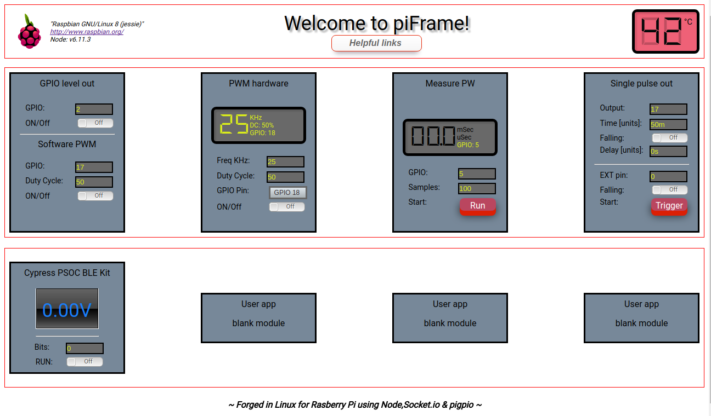

# piFrame Help
<i>Updated 1NOV2017 by Kevin Waite</i> 
 

 

A Node web server for Raspberry Pi electronics testing. Hack it , mod it, do as you wish with it.
There are pre-built, ready to go modules which include:
<ul>
  <li> Level out high or low - turn something on / off </li>
  <li> Software PWM - select a pin and PWM duty cycle </li>
  <li> Square wave out - select pin, frequency & duty cycle</li>
  <li> Measure a pulse width</li>
  <li> Trigger pulse output with many options</li>
  <li> SPI interface to the Cypress PSOC BLE Pioneer kit [or use Arduino, etc.]</li>
  <li> Flex containers for your own apps</li> 
 </ul>
The modules will work out of the box with the pi 3 and 2, and others.Recommended to use a Raspberry Pi 3 for best performance. 
<h3>Installation</h3>
1. Install Node / npm on your pi using nvm, if not already present. I am using the LTS version for ARM V8.  
    Please use nvm to install Node & npm onto your pi. This will ensure you have the latest & correct version.
    Documentation for nvm:  
    <a href="https://github.com/creationix/nvm#verify-installation">creationix nvm</a>
     
    <a href="https://www.losant.com/blog/how-to-install-nodejs-on-raspberry-pi">Install Node.js using nvm</a>
     
2. Unzip piFrame into your Node directory. 
3. Run with the provided shell script:
    Linux - run the 'piframe.sh' as 'sudo ./piframe.sh' from the piFrame directory on your Raspberry Pi. Open your local         device browser at 'yourPi_IPaddress:3000'. The node server outputs the web page on port 3000 - remember that both the Pi     and your local PC, tablet, or phone must be on the same local network.
    You may find your Pi's IP address by using the shell script from the Master branch [Pi-startSSH.sh] OR your modem/           router config page, or in Linux by using these instructions <a href="https://www.raspberrypi.org/documentation/remote-access/ip-address.md"> nmap help </a>
    At this point you should see piFrame running.  
    

    Main files from the Master Branch: 
    <ul>
    <li>piframe.html -Client html</li>
    <li>package.json -list of npm packages used</li>
    <li>piframe.js -Server side Node script</li>
    <li>public/gpiotest -Bash script; use standalone to test your GPIO pins.(Not written by my me)</li>
    <li>piFrameControls.js -Client side javascript</li>
    <li>Pi-startSSH.sh -after cloning move to your local machine. You can use this to easily get the pi address & SSH                 in.
    </li>
    </ul>
    Development tip: Mount your PiFrame directory on the Raspberry Pi to your local machine, then use Atom or your favorite       editor to edit / save changes.Look in the PiWiki notebook for instructions on how to do this.
    

 
<h3>Help on modules</h3>
<ul>
  Raspberry Pie die temperature - shown in the right-most section of web banner, in degrees C. This runs in 5 second           intervals; if you wish to turn this off, do it in piFrameControls.js by commenting out this line 'Mysocket.emit('ReqTemp')'
   
<li>
 
</li>
<li>
  GIO Level out - Simply outputs a high or low logic level to the selected pin. 
   
</li>
<li>
  Software PWM - Outputs a PWM signal of approx. 800Hz to the selected pin. The frequency is fxed but you may change the duty   cycle between zero and 255, with 128 being 50%. To change duty cycle, turn OFF the function, change the duty cycle then       turn   on.
   
</li>
<li>
  PWM Hardware - Outputs PWM to selected pins - note that these pins are limited to the PI being used. Pin 18 is common to     all Pi's with dedicated hardware PWM. Set frequency,duty cycle and outpin pin, turn function on or off. The frequency input   MAY use decimal fractions, the Duty Cycle can only accept integers [0 to 99%].The upper limit on my Raspberry Pi3 is around   20MHz although your results may vary. Admittedly at 20MHz the signal turns into a sawtooth, but it would be usable with       conditioning circuitry. I observed over-shoots on lower frequencies and deformation at high frequencies. Remember that the   Pi has an exremely limited output power on all pins so ALL inputs and outputs need to be conditioned, in any event.
   
 </li>
 <li>
  Measure PW - Measure a pulse width. Set the input pin, the sample rate, and press the Run button. I have not yet tested the   min and max limits.
   
 </li>
 <li>
  Single pulse output - Use this to output a single trigger, perhaps for oscilloscope triggering or into another circuit. You   can also trigger from another incoming signal, either on the rising or falling edge. You may set a delay before the trigger   occurs, post trigger condition. Note that the delay setting takes one of 4 parameters: 's' for seconds. 'm' for               milliseconds,'u' for microseconds, 'n' for nanoseconds. The default is zero seconds. To trigger immediately without an       external pin, simply set the EXT pin to zero- trigger will occur when the button is pressed.
   
</li>
<li>
  Cypress PSOC BLE Kit - I am using here the Cypress CY8CKIT-042-BLE Pioneer Kit as an SPI slave on Bus 0, device 0 of the Pi   3. Simply set up the board of your choice as an SPI slave in Mode 0,0. Note that you will need to change the piframe.js       file to transfer the number of bytes that you wish. In my case, I am transferring 5 bytes but only 4 are used , for a total   of 32 bits transfer. Anything that you can achieve with your development board can now be controlled and data displayed       through the Node server on the Pi, which for me is the most exciting aspect of this project. 
   
</li>
</ul>

There is also included in the main branch a tiddlyWiki digital notebook for Raspberry Pi [editable single file html]. It  contains notes and links, use it as your own, edit as desired.

