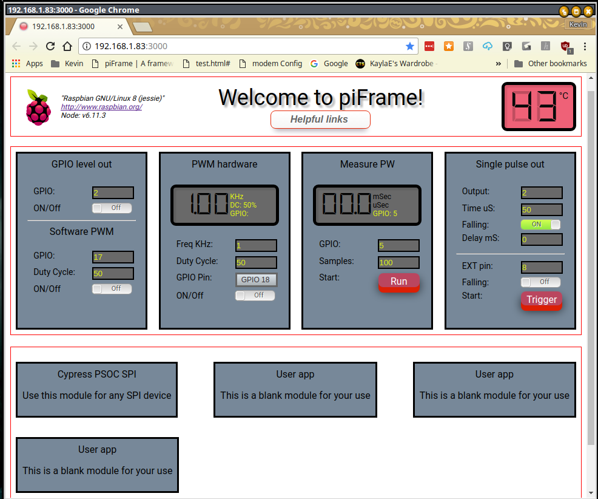

# piFrame Help
<i>Updated 03OCT2017 by Kevin Waite</i> 
 

 

A Node web server for Raspberry Pi electronics testing
There are pre-built, ready to go modules which include:
<ul>
  <li> Level out high or low - turn something on / off </li>
  <li> Software PWM - select a pin and PWM duty cycle </li>
  <li> Square wave out - select pin, frequency & duty cycle</li>
  <li> Measure a pulse width</li>
  <li> Trigger pulse output with many options</li>
  <li> SPI interface to the Cypress PSOC Pioneer kit [or use Arduino, etc.]</li>
  <li> A flex container for you to write your own app</li> 
  <li> A tiddlyWiki digital notebook for Raspberry Pi [editable single file html] </li>
</ul>
The modules will work out of the box with the pi 3 and 2, and others.Recommended to use a Raspberry Pi 3 for best performance. 
<h3>Installation</h3>
1. Install Node / npm on your pi using nvm, if not already present. I am using the LTS version for ARM V8.  
    Please use nvm to install Node & npm onto your pi. This will ensure you have the latest & correct version.
    Documentation for nvm:  
    <a href="https://github.com/creationix/nvm#verify-installation">creationix nvm</a>
     
    <a href="https://www.losant.com/blog/how-to-install-nodejs-on-raspberry-pi">Install Node.js using nvm</a>
     
2. CLone piFrame into your pi or - unzip the piFrame into your Node directory. 
3. Run with the provided shell script:
    Linux - run the 'piframe.sh' as './piframe.sh' from the piFrame directory on your Raspberry Pi. Open your local browser       at 'yourPi_IPaddress:3000'. The node server outputs the web page on port 3000 - remember that both the Pi and your local     PC, tablet, or phone must be on the same local address, irregardless if you are using WiFi or ethernet.
    You may find your Pi's IP address by using your modem/ router config page, or in Linux by running <a    href="https://www.raspberrypi.org/documentation/remote-access/ip-address.md"> nmap help </a>
    At this point you should see piFrame running.  
    

    Main files 
    <ul>
    <li>piframe.html -Client html</li>
    <li>package.json -list of npm packages used</li>
    <li>piframe.js -Server side Node script</li>
    <li>public/gpiotest -Use standalone to test your GPIO pins.</li>
    <li>public/js/piFrameControls.js -Client side javascript</li>
    <li>public/Pi-startSSH.sh -after cloning move to your local machine. You can use this to easily get the pi address & SSH      in.</li>
    </ul>
    

 
<h3>Help on modules</h3>

